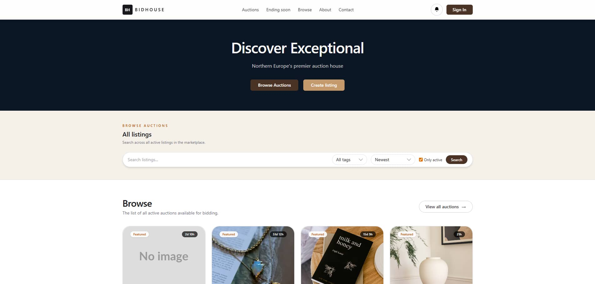

# BidHouse — Auction Marketplace



**Semester Project 2 — Noroff Front-End Development**

BidHouse is a responsive auction marketplace built with HTML, Tailwind CSS and vanilla JavaScript, integrated with the Noroff Auction API v2. Users can discover listings, create auctions, place bids, manage their profile and track won auctions through a polished and user-focused interface.

## Live Demo

* [View deployed application](https://bidhouseweb.netlify.app/)

## Project Resources

* [GitHub Repository](https://github.com/Wojciech094/BidHouse)
* [Figma Design](https://www.figma.com/design/r7xFWxpezkvcGRC5nRjs2B/BidHouse?node-id=0-1&t=r0lf3JKbTWowO6mr-1)
* [GitHub Project Board](https://github.com/users/Wojciech094/projects/10)
* [Noroff Auction API Documentation](https://docs.noroff.dev/docs/v2/auction-house/listings)

## Project Overview

BidHouse was developed as Semester Project 2. The goal was to build a complete auction marketplace where registered users can interact with live listing data through the Noroff Auction API.

The application includes authentication, listing management, bidding, credit tracking, profile customization and won-auction monitoring. The interface was designed to feel clear and professional while remaining responsive across different screen sizes.

## Features

### Authentication

* Registration restricted to `@stud.noroff.no` email addresses
* Token-based login and logout
* Automatic Noroff API key creation
* Dynamic header displaying username, available credits and new wins

### Profile System

* Avatar, banner, bio and credits display
* Edit profile functionality with live media previews
* Overview of listings, wins and active bids
* Preview sections with navigation to full activity pages

### Auction Listings

* Browse active listings
* Search listings by keyword
* Filter listings by tags
* Sort by newest, oldest, ending soon and price
* Lazy-loaded images and load-more pagination
* Detailed single listing page containing:

  * listing image,
  * seller information,
  * current highest bid,
  * bid count and bid history,
  * active or ended status,
  * contextual bidding form.

### Listing Management

* Create new auction listings
* Add media through external image URLs
* Live media preview while creating and editing listings
* Edit listings before bids have been placed
* Delete listings before bids have been placed

### Bidding System

* Place bids from listings and detailed auction views
* Input validation with success and error feedback
* Prevention of bidding on your own listings
* Updated UI feedback after successful bid submission

### Wins and Notifications

* Dedicated `My Wins` page
* Header notification badge for newly won auctions
* Badge reset after visiting wins
* Last-seen win count stored locally

## Portfolio 2 Improvement

For Portfolio 2, BidHouse was reviewed and refined for professional presentation.

The main improvement focused on media reliability across the marketplace:

* added a local placeholder image for auction listings,
* handled missing listing images consistently,
* handled unavailable or broken external image URLs,
* applied the fallback across the homepage, single listing view, My Listings, My Bids, My Wins and profile listing previews.

Because users provide listing images through external URLs, images can become unavailable over time. Before this improvement, broken URLs could display missing-image icons and create inconsistent card layouts. The new fallback solution keeps the marketplace visually reliable and professional across all major listing views.

## Technologies Used

* HTML5
* Tailwind CSS
* Vanilla JavaScript
* Vite
* Noroff Auction API v2
* Netlify
* Figma
* GitHub Projects

## Getting Started

### Prerequisites

Make sure you have installed:

* Node.js version 18 or newer
* npm

### Installation

1. Clone the repository:

   ```bash
   git clone https://github.com/Wojciech094/BidHouse.git
   ```

2. Navigate into the project directory:

   ```bash
   cd BidHouse
   ```

3. Install dependencies:

   ```bash
   npm install
   ```

4. Start the development server:

   ```bash
   npm run dev
   ```

5. Open the local URL shown in the terminal.

## Build for Production

To create a production build:

```bash
npm run build
```

To preview the production build locally:

```bash
npm run preview
```

## File Structure

```text
├── public/
│   ├── credits.svg
│   ├── listing-placeholder.svg
│   └── images/
│       └── bidhouse.jpg
├── src/
│   ├── style.css
│   └── js/
│       ├── auth.js
│       ├── utils.js
│       ├── index.js
│       ├── single-listing.js
│       ├── create.js
│       ├── edit-listing.js
│       ├── profile.js
│       ├── edit-profile.js
│       ├── my-listings.js
│       ├── my-bids.js
│       ├── my-wins.js
│       └── login-reg.js
├── index.html
├── single.html
├── create.html
├── edit-listing.html
├── edit-profile.html
├── profile.html
├── my-listings.html
├── my-bids.html
├── my-wins.html
├── login.html
├── register.html
├── contact.html
├── about.html
├── tailwind.config.js
├── vite.config.ts
└── package.json
```

## Deployment

The project is deployed on Netlify and runs fully client-side. The production application is built from the main branch.

* [Open live application](https://bidhouseweb.netlify.app/)

## License

This project was created for educational purposes as part of Semester Project 2 at Noroff Front-End Development.
